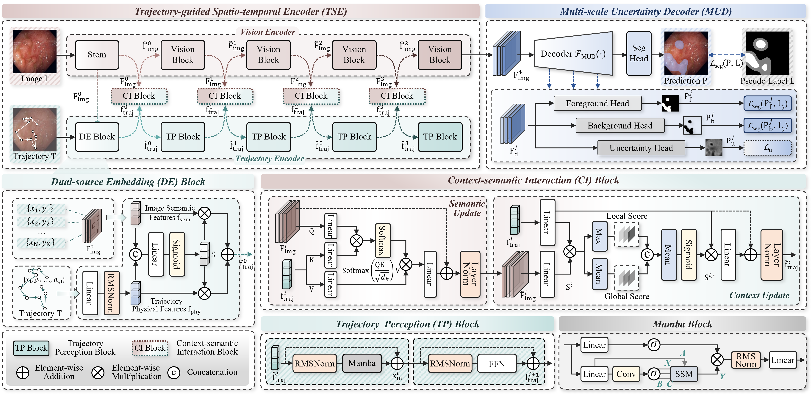
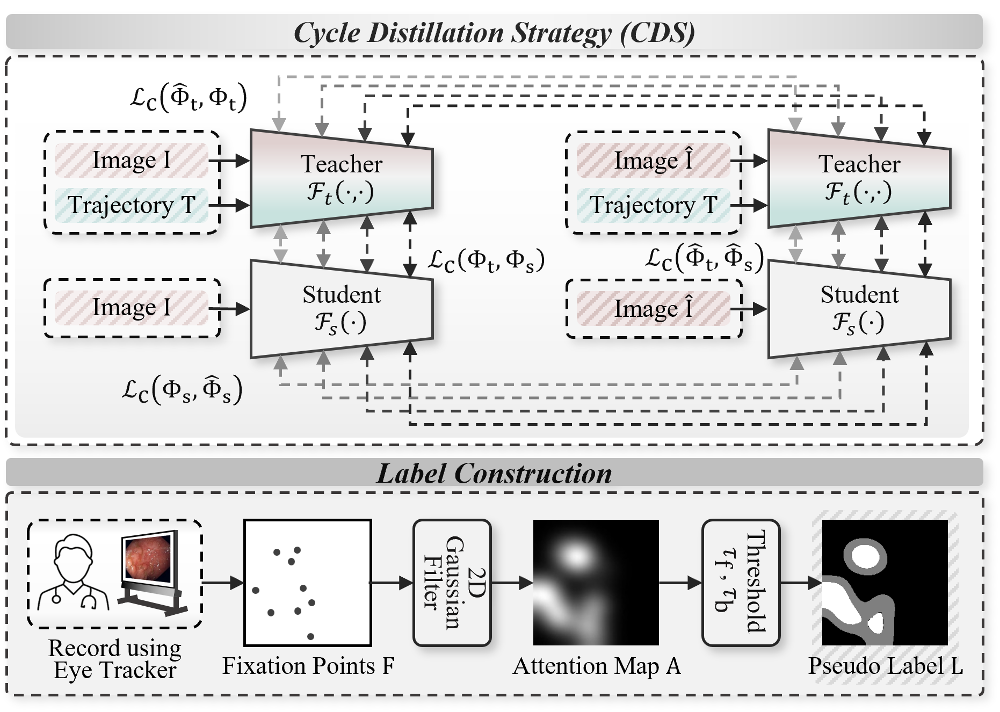
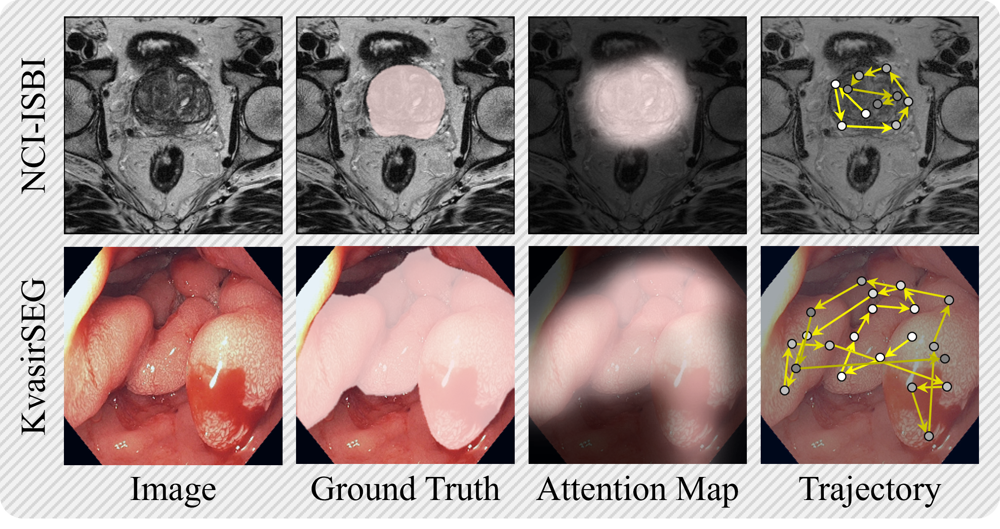
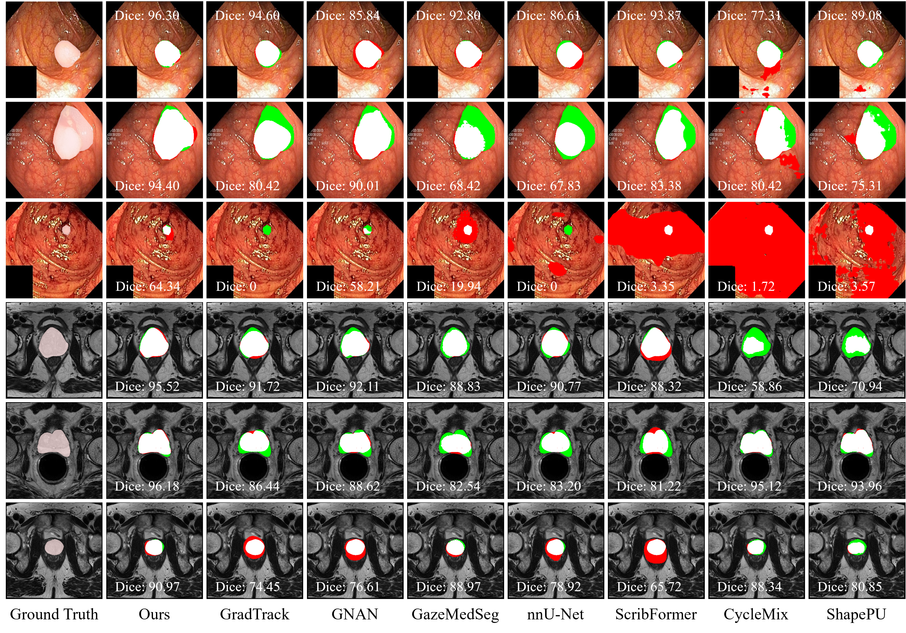
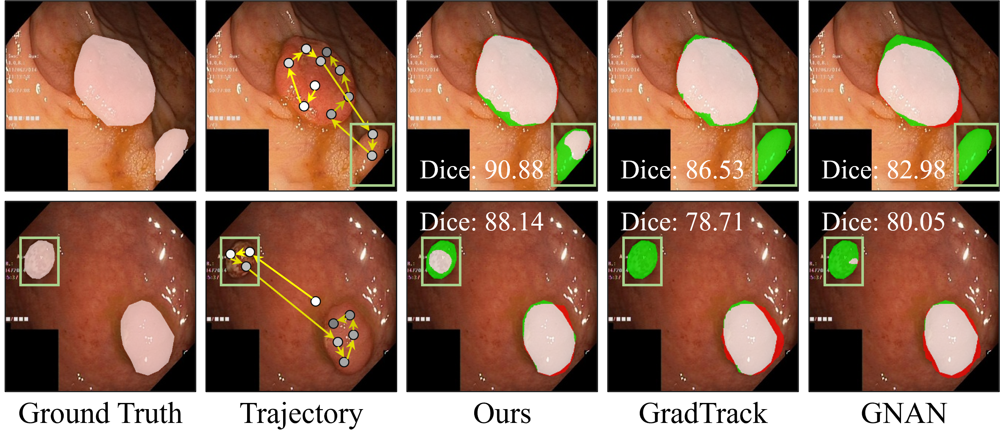

## From Spatial Semantics to Temporal Context: Leveraging Gaze Trajectory for Weakly Supervised Medical Image Segmentation

This project contains the training and testing code for the paper, as well as the model weights trained according to our method.

> Medical image segmentation heavily depends on labor-intensive and time-consuming pixel-level annotations. Eye tracking offers a cost-effective solution that can be naturally integrated into clinical workflows. 
Recorded by eye trackers, gaze conveys the spatial regions of clinicians' attention through fixations and the temporal context of clinicians' progressive visual perception from trajectories.
Nevertheless, effective modeling of temporal trajectories remains challenging, and noise in gaze caused by exploratory fixations greatly limits segmentation performance.
To overcome these limitations, we propose the Trajectory-guided Uncertainty-aware Network (TrailNet), which exploits gaze-supervised medical image segmentation from spatial semantics modeling to temporal context by jointly leveraging fixations and trajectories.
Specifically, the proposed trajectory-guided spatio-temporal encoder models temporal context and establishes complementary interactions with image spatial semantics to strengthen target perception. Furthermore, the multi-scale uncertainty decoder leverages category mutual-exclusivity constraints to produce deterministic predictions and mitigate supervision uncertainty induced by noise. 
To enable gaze-free inference, we further introduce a cycle distillation strategy that transfers feature-level knowledge via teacher-student networks.
Experimental results on two public datasets demonstrate that TrailNet outperforms state-of-the-art methods, achieving Dice scores of 81.25\% and 81.85\%, respectively.


Overview of TrailNet, which consists of three core modules. TSE achieves Context-semantic Interaction of spatial image semantics and temporal trajectory features. MUD alleviates gaze noise via category mutual-exclusivity constraints. 
In TSE, DE produces initial trajectory embeddings, TP models trajectory temporal context through a two-layer residual Mamba structure, and CI implements progressive mutual enhancement between spatial semantics and trajectory context.

 

CDS constructs cycle distillation constraints with teacher-student networks for feature-level knowledge distillation. The attention map is generated by a 2D Gaussian filter on the fixation, and pseudo-labels are obtained with the thresholds $\tau_{\text{f}}$ and $\tau_{\text{b}}$.

## Model Weights
The performance of our method is expressed as the mean and standard deviation of three different seed runs.
| |  NCI-ISBI |  KvasirSEG |
| :-: | :-: | :-: |
| Ours | 81.25±0.30 | 81.85±0.39 |

The weight will be released after the paper is accepted.


## Public Datasets
 

The gaze of GazeMedSeg dataset can be downloaded at [Gaze](https://drive.google.com/drive/folders/1-38bG_81OsGVCb_trI00GSqfB_shCUQG).\
The GazeMedSeg dataset can download at [GazeMedSeg](https://drive.google.com/drive/folders/1XjgQ27R8zT8ymOTXohgl8HXntPEUbIXj).

The Kvasir dataset can download at [Kvasir](https://datasets.simula.no/kvasir-seg/).\
The NCI-ISBI dataset can download at [NCI](https://www.cancerimagingarchive.net/analysis-result/isbi-mr-prostate-2013/).

## Qualitative Results

Qualitative comparison of TrailNet with other state-of-the-art methods. Over-segmented areas are marked in red, and under-segmented areas are marked in green.

 

Visualization of the contribution of trajectories in segmentation. Methods without explicit temporal trajectory modeling fail to detect tiny polyps (marked by green boxes), while the proposed method accurately identifies these lesions under trajectory guidance.
## Requirements
```
python == 3.8
torch == 1.12.0
numpy == 1.24.4
medpy == 0.5.1
nibabel == 5.2.1
pandas == 2.0.3
scikit-image == 0.21.0
```
